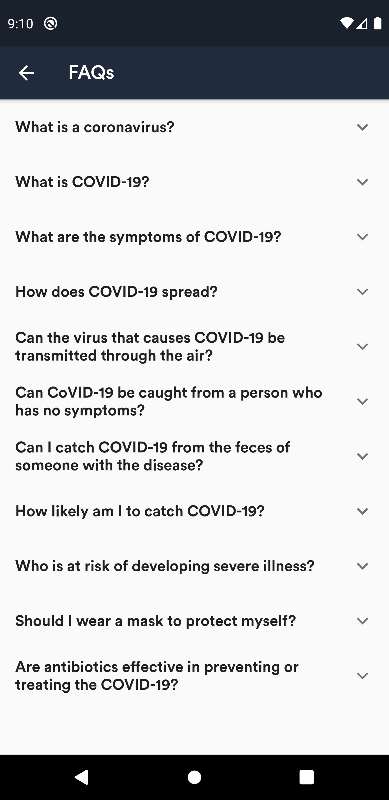
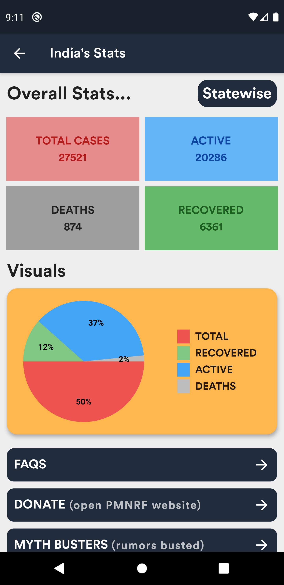

# CORONA TRACKER App 🦠

A Flutter project to provide Real-time statistics of Novel Corona virus.

### Show some :heart: and star the repo to support the project

[](https://github.com/hiteshgarg123/CORONA-TRACKER/)
[](https://github.com/hiteshgarg123/CORONA-TRACKER/)
[](https://lbesson.mit-license.org/)
[](https://github.com/hiteshgarg123/CORONA-TRACKER/)
[](https://github.com/hiteshgarg123?tab=followers)

## Getting Started 🚀

- Clone the repo `git clone https://github.com/hiteshgarg123/CORONA-TRACKER`
- Install the dependicies `flutter pub get`
- Run it `flutter run`

## Features 💡

- Based on BLoC Architecture.
- Shows Worldwide as well as Country-wise stats.
- Dedicated pages for India's stats.
- Statewise stats of India.
- Added beautiful PieCharts for data visualisation.
- Myth Buster section.
- FAQs Section.
- Search Functionality (in countrywise stats and India's statewise stats).
- You can directly donate to PMNRF by opening from App.

## Recent Update

- Complete Data Caching with Hive Database.

## To be implemented 📝

- [x] Complete Data Caching Service
- [ ] Date and Numbers formatting.
- [ ] Last Refreshed/Updated.
- [ ] Dark mode.
- [ ] Top banner cutting in low ppi devices.
- [ ] Fix margins(of chart) in low ppi devices.

## Dependencies ✨

<details><summary>CLICK ME TO EXPAND</summary>
<p>

```dart
flutter_spinkit: ^4.1.2
hive: ^1.4.4+1
hive_flutter: ^0.3.1
http: ^0.12.0+4
liquid_pull_to_refresh: ^2.0.0
pie_chart: ^3.1.1
provider: ^4.1.3
shared_preferences: ^0.5.6+3
url_launcher: ^5.4.2
build_runner: ^1.10.4
hive_generator: ^0.8.2
flutter_launcher_icons: "^0.7.3"
```

</p>
</details>

## Preview 📸

|                                           |                                           |                                           |
| ----------------------------------------- | ----------------------------------------- | ----------------------------------------- |
|  |  |  |

|                                           |                                           |                                           |
| ----------------------------------------- | ----------------------------------------- | ----------------------------------------- |
|  |  |  |

# Pull Requests

I welcome and encourage all pull requests. It usually will take me within 24-48 hours to respond to any issue or request. Here are some basic rules to follow to ensure timely addition of your request:

1.  Match the document style as closely as possible.
2.  Please keep PR titles easy to read and descriptive of changes, this will make them easier to merge :)
3.  Pull requests _must_ be made against `master` branch for this particular repository.
4.  Have fun!

### Created & Maintained By

[Hitesh Garg](https://github.com/hiteshgarg123) ([@hiteshgarg285](https://www.twitter.com/hiteshgarg285)) ([Instagram](https://www.instagram.com/hiteshgarg2855))

## Getting Started

For help getting started with Flutter, view our
[online documentation](https://flutter.dev/docs), which offers tutorials,
samples, guidance on mobile development, and a full API reference.
