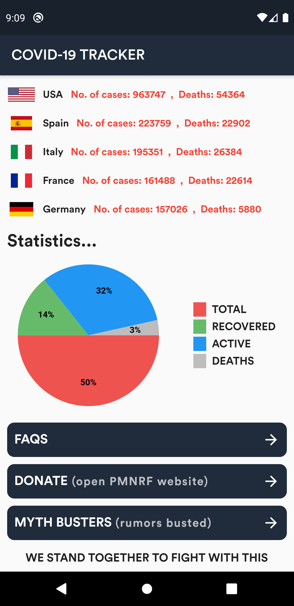
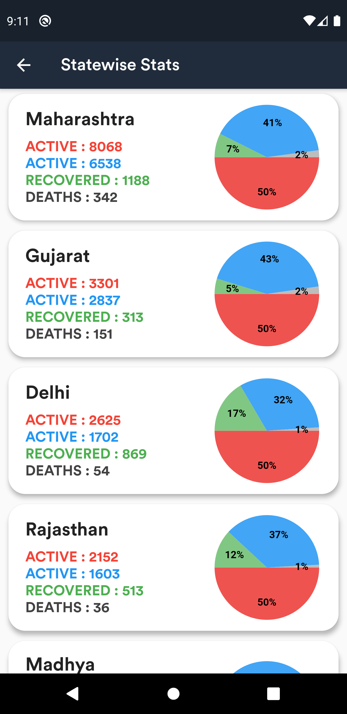

# COVID-19 TRACKER App 🦠

A Flutter project to provide Real-time statistics of Novel Corona virus.

## Getting Started 🚀

- Clone the repo
- Install the dependicies
- Run it `flutter run`

## Features.

- Shows Worldwide statistics as well as Country-wise statistics.
- Dedicated pages for India's statistics.
- Statewise statistics of India.
- Added beautiful PieCharts for more data visualisation.
- Myth Busters section.
- FAQs Section.
- You can directly donate to PMNRF by opening from App.

## To be implemented.

- Search Functionality.
- Dark theme mode.
- Top banner cutting in low ppi devices.
- Fix margins(of chart) in low ppi devices

## Preview 📸

|                                           |                                           |                                           |
| ----------------------------------------- | ----------------------------------------- | ----------------------------------------- |
|  |  |  |

|                                           |                                           |                                           |
| ----------------------------------------- | ----------------------------------------- | ----------------------------------------- |
|  |  |  |

## Contact me 📧

#### Email : hiteshgarg285@gmail.com
