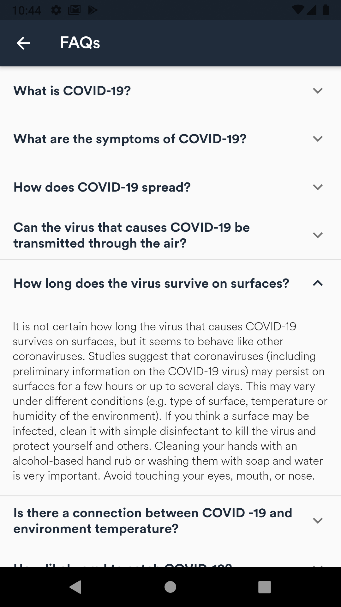
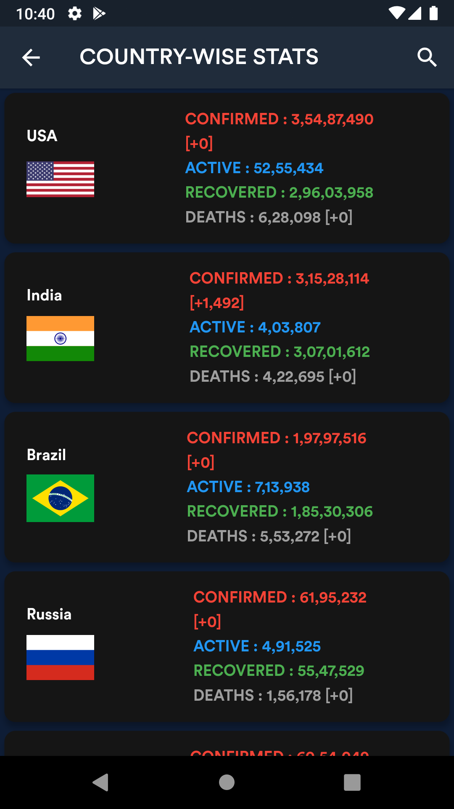

# CORONA TRACKER App 🦠

A Flutter project to provide Real-time statistics of Novel Corona virus.

### Show some :heart: and star the repo to support the project

[](https://github.com/hiteshgarg123/CORONA-TRACKER/)
[](https://github.com/hiteshgarg123/CORONA-TRACKER/)
[](https://pub.dev/packages/lint)
[](https://lbesson.mit-license.org/)

[](https://github.com/hiteshgarg123/CORONA-TRACKER/)
[](https://github.com/hiteshgarg123?tab=followers)

## Getting Started 🚀

- Clone the repo `git clone https://github.com/hiteshgarg123/CORONA-TRACKER`
- Install the dependicies `flutter pub get`
- Run it `flutter run`

## Features 💡

- Based on BLoC & Provider Architecture.
- Null Safe Code-base.
- Shows Worldwide as well as Country-wise stats.
- Dedicated pages for India's stats.
- Statewise stats of India.
- Beautiful PieCharts for data visualisation.
- Myth Buster section.
- FAQs Section.
- Search Functionality (in countrywise stats and India's statewise stats).
- You can directly donate to PMNRF by opening from App.

## Recent Changes 🕒

- Linter Enabled.
- Null Safety Migration.
- Complete Data Caching.
- Error Handling.
- Beautiful Dark Theme.

## To be implemented 📝

- [x] Complete Data Caching Service.
- [x] Error Handling.
- [x] Dark mode.
- [x] Top banner cutting in some devices [FIXED].
- [x] Pie Charts cutting from right side in some devices [FIXED].
- [x] Date and Numbers formatting.
- [ ] Last Refreshed/Updated.
- [ ] Top buttons `Regional` and `India Stats` not fitting on screen in some devices.

## Dependencies ✨

<details><summary>CLICK ME TO EXPAND</summary>
<p>

```dart
auto_size_text: ^3.0.0-nullsafety.0
cached_network_image: ^3.0.0
cupertino_icons: ^1.0.2
day_night_switcher: ^0.2.0+1
fl_chart: ^0.36.0
flutter_spinkit: ^5.0.0
fluttertoast: ^8.0.6
hive: ^2.0.4
hive_flutter: ^1.0.0
http: ^0.13.2
intl: ^0.17.0
liquid_pull_to_refresh: ^3.0.0
pie_chart: ^5.0.0
provider: ^5.0.0
shared_preferences: ^2.0.5
url_launcher: ^6.0.3
```

</p>
</details>

# Preview 📸

## Light Theme 🌞

|                                                       |                                                       |                                                       |
| ----------------------------------------------------- | ----------------------------------------------------- | ----------------------------------------------------- |
|  |  |  |

|                                                       |                                                       |                                                       |
| ----------------------------------------------------- | ----------------------------------------------------- | ----------------------------------------------------- |
|  |  |  |

## Dark Theme 🌑

|                                                      |                                                      |                                                      |
| ---------------------------------------------------- | ---------------------------------------------------- | ---------------------------------------------------- |
|  |  |  |

|                                                      |                                                      |                                                      |
| ---------------------------------------------------- | ---------------------------------------------------- | ---------------------------------------------------- |
|  |  |  |

## Pull Requests

I welcome and encourage all pull requests. It usually will take me within 24-48 hours to respond to any issue or request. Here are some basic rules to follow to ensure timely addition of your request:

1.  Match the document style as closely as possible.
2.  Please keep PR titles easy to read and descriptive of changes, this will make them easier to merge.
3.  Pull requests _must_ be made against `master` branch for this particular repository.
4.  Have fun!

### Created & Maintained By

[Hitesh Garg](https://github.com/hiteshgarg123) ([@hiteshgarg285](https://www.twitter.com/hiteshgarg285)) ([Instagram](https://www.instagram.com/hiteshgarg2855))

## Getting Started

For help getting started with Flutter, view our
[online documentation](https://flutter.dev/docs), which offers tutorials,
samples, guidance on mobile development, and a full API reference.
